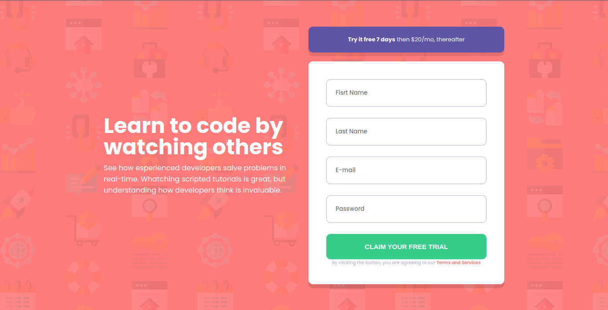

# Frontend Mentor - Componente de introdução com solução de formulário de inscrição

Esta é uma solução para o [Component component with sign up form challenge on Frontend Mentor](https://www.frontendmentor.io/challenges/intro-component-with-signup-form-5cf91bd49edda32581d28fd1). Os desafios do Frontend Mentor ajudam você a melhorar suas habilidades de codificação criando projetos realistas.

## Índice

- [Visão geral](#visão geral)
  - [O desafio](#the-challenge)
  - [Captura de tela](#captura de tela)
  - [Links](#links)
  
- [Meu processo](#meu-processo)
  - [Construído com](#construído com)
  
- [Autor](#autor)

  
## Visão geral

### O desafio

Os usuários devem ser capazes de:

- Visualize o layout ideal para o site, dependendo do tamanho da tela do dispositivo
- Veja os estados de foco para todos os elementos interativos na página
- Receba uma mensagem de erro quando o `form` for enviado se:
  - Qualquer campo `input` está vazio. A mensagem para este erro deve dizer *"[Nome do campo] não pode ser vazio"*
  - O endereço de e-mail não está formatado corretamente (ou seja, um endereço de e-mail correto deve ter esta estrutura: `name@host.tld`). A mensagem para este erro deve dizer *"Parece que isso não é um email"*

### Captura de tela

### Links

- URL da solução: [https://github.com/esdrasspessoa/telaCadastroDeUsuario](https://github.com/esdrasspessoa/telaCadastroDeUsuario)
- URL do site ao vivo: [https://esdrasspessoa.github.io/htmlCss/telaDeCadastroDeUsuario/](https://esdrasspessoa.github.io/htmlCss/telaDeCadastroDeUsuario/)

## Meu processo

### Construído com

- Marcação HTML5 semântica
- Propriedades personalizadas de CSS
- Flexbox
- Fluxo de trabalho mobile-first
- SCSS
- JavaScript

## Autor

- Site - [Developed by Bob®](https://esdrasspessoa.github.io/)
- Mentor de frontend - [@esdrasspessoa](https://www.frontendmentor.io/profile/esdrasspessoa)
- Instagram - [@mano_ed2](https://www.instagram.com/mano_ed2/)
- Linkedin - [Esdras](https://www.linkedin.com/in/esdrasspessoa/)

